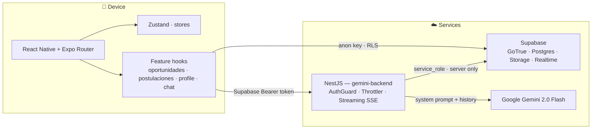

<div align="center">

# VoluntariadoUPB — Plantini

**University volunteering mobile app for Universidad Privada Boliviana.**
Connects students with real opportunities: applications, map, gamification, and an AI-powered conversational assistant.

[](https://expo.dev)
[](https://reactnative.dev)
[](https://www.typescriptlang.org/)
[](https://supabase.com)
[]()

</div>

---

## What is this?

**Plantini** is the mobile app for UPB's volunteering program. It lets students browse opportunities, apply, track their impact, and chat with an AI assistant. The app talks to two external services:

- **Supabase** — authentication, Postgres database, and image storage.
- **Gemini Backend** (sibling folder [`../gemini-backend`](../gemini-backend)) — a secure NestJS proxy to Google Gemini for the in-app AI chat.

> Related docs: [`../ESTADO_PROYECTO.md`](../ESTADO_PROYECTO.md) for a full technical analysis, and [`../GUIA_MEJORAS_MANUALES.md`](../GUIA_MEJORAS_MANUALES.md) for steps that require manual Supabase / GitHub / device work.

---

## Architecture



Data always flows **screen → hook → supabase client**. No component calls `supabase.from(...)` directly — that keeps auth, pagination, and error handling in a single place.

---

## Stack

| Layer | Technology |
| --- | --- |
| Framework | React Native 0.81 + Expo SDK 54 |
| Language | TypeScript 5.9 (`strict: true`) |
| Routing | Expo Router 6 (file-based) |
| State | Zustand 4.5 |
| Auth + DB | Supabase JS (GoTrue + Postgres with RLS) |
| Storage | Supabase Storage |
| Maps | `react-native-maps` |
| Animations | `react-native-reanimated` 4 |
| Gestures | `react-native-gesture-handler` 2 |
| Notifications | `expo-notifications` (local) |
| Geolocation | `expo-location` |
| Images | `expo-image-picker` |
| AI Chat | HTTP streaming to the NestJS backend |
| Tests | Jest + ts-jest (Node) |

> No Firebase. No Cloudinary. All persistence runs on Supabase.

---

## Setup

### Requirements

- **Node.js** ≥ 20
- **npm** ≥ 10 (or `yarn`)
- A **Supabase** project with the schema from [`../gemini-backend/sql/schema.sql`](../gemini-backend/sql/schema.sql) applied
- For device testing: the **Expo Go** app or a dev build

### 1. Environment variables

Create `.env` in this folder based on [`.env.example`](.env.example):

```bash
EXPO_PUBLIC_SUPABASE_URL=https://your-project.supabase.co
EXPO_PUBLIC_SUPABASE_ANON_KEY=eyJh...   # anon key — NEVER the service_role
```

> The `EXPO_PUBLIC_` prefix is required: without it Expo won't inject the
> value into the JS bundle and you'll get `undefined` at runtime.

The NestJS backend URL for the AI chat is configured in
[`app.json`](app.json) → `expo.extra.GEMINI_BASE_URL`
(default: `http://localhost:3000`).

### 2. Install and run

```bash
npm install
npm run start         # Expo dev server (QR code for Expo Go)
```

Other scripts:

```bash
npm run android       # Android emulator / device
npm run ios           # iOS simulator (requires macOS + Xcode)
npm run web           # Web build on http://localhost:4000
npm run typecheck     # tsc --noEmit
npm test              # Jest
```

### 3. AI chat backend

The Plantini chat needs the backend running in parallel. See
[`../gemini-backend/README.md`](../gemini-backend/README.md).

---

## Project structure

```
VoluntariadoUPB/
├── app/                       # Expo Router (file-based)
│   ├── (auth)/                # Login / Register
│   ├── (drawer)/
│   │   ├── (tabs)/            # Opportunities · Map · Applications · Profile
│   │   ├── (admin)/           # Admin panel
│   │   └── chat.tsx           # Plantini assistant (Gemini)
│   ├── onboarding.tsx
│   └── _layout.tsx            # Root <Stack> + auth state subscription
├── src/
│   ├── components/            # Domain UI (oportunidades, profile, …)
│   ├── features/
│   │   └── chat/              # Self-contained AI chat sub-feature
│   ├── hooks/                 # Supabase reads/writes per feature
│   ├── services/              # Notifications, scheduler
│   ├── store/                 # Zustand: auth, theme, oportunidades
│   ├── types/                 # Domain types (Oportunidad, Postulacion, …)
│   └── utils/                 # Pure helpers (mapAuthError, …)
├── config/                    # Supabase client + Gemini constants
├── assets/
├── app.json
└── package.json
```

### Conventions

- **Spanish identifiers** (`oportunidad`, `postulacion`, `cupos`) mirror the Postgres schema. **Do not translate them.**
- Hooks (`src/hooks/<feature>/`) are the only layer that calls Supabase.
- `mountedRef` pattern in hooks to avoid `setState` on unmounted components.

---

## Tests

```bash
npm test
```

Current minimal coverage:

- `src/utils/__tests__/mapAuthError.test.ts` — Supabase → Spanish error mapping (pure logic).
- `src/store/__tests__/useAuthStore.test.ts` — `signIn` / `signUp` flows with a mocked Supabase client.

Tests run in Node via `ts-jest` (no RN preset) to keep execution time low. For full component rendering tests, migrate to `jest-expo` + `@testing-library/react-native`.

---

## Troubleshooting

| Symptom | Likely cause | Fix |
| --- | --- | --- |
| `undefined` in `process.env.EXPO_PUBLIC_*` | Missing prefix or missing `.env` | Check `EXPO_PUBLIC_` prefix and restart Metro |
| AI chat returns 401 | Expired Supabase token / backend not receiving `Authorization` | Sign out and sign back in |
| `Network request failed` on physical device | `GEMINI_BASE_URL` points to `localhost` | Change to LAN IP or use Expo tunnel |
| Notifications not arriving | Expo Go doesn't support remote push | Use a dev build |

---

## License

Private. Academic project for Universidad Privada Boliviana.
